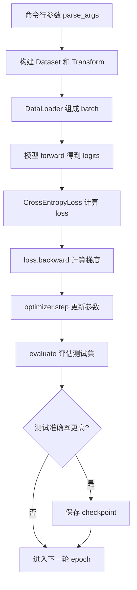

# PyTorch 图像分类训练完整教学文档

本文档基于当前文件夹里的 `pytorch-cifar` 学习项目，目标是让你能够完整理解一个 PyTorch 训练程序从数据到模型、从 loss 到反向传播、从评估到保存权重的全流程。

推荐先跑通默认命令，再边读文档边打开代码：

```powershell
cd "D:\Anaconda Prompt\pytorch-cifar"
& "D:\anaconda3\Scripts\conda.exe" run -n dlgpu python main.py --epochs 10
```

默认运行内容：

- 数据集：`Digits`，来自 scikit-learn 的小型手写数字图像数据集。
- 模型：`LeNet`，一个适合初学者理解的卷积神经网络。
- 优化器：`Adam`。
- 设备：如果 CUDA 可用，自动使用你的 NVIDIA GPU。
- 输出：每个 epoch 打印训练和测试 loss/accuracy，并保存最好的 checkpoint。

## 1. 项目结构

核心文件如下：

```text
pytorch-cifar/
  main.py                         # 训练入口：数据、模型、loss、optimizer、训练、评估、保存
  models/
    __init__.py                   # 暴露所有模型构造函数
    lenet.py                      # 最适合初学者阅读的小 CNN
    resnet.py                     # 更深的残差网络
    ...                           # 原项目里的其他 CNN
  utils.py                        # 进度条和辅助函数
  checkpoint/
    digits_lenet_best.pth         # 已跑通后保存的最佳模型权重
  LEARNING.md                     # 快速命令和实验建议
  PYTORCH_TRAINING_GUIDE.md       # 你正在读的详细教学文档
```

如果你只想理解 PyTorch 训练，先读这三个文件就够了：

1. `main.py`
2. `models/lenet.py`
3. `utils.py`

## 2. 一次训练程序到底在做什么

一个标准 PyTorch 图像分类训练程序可以拆成 8 步：

1. 读取命令行参数，例如训练多少轮、用什么模型、学习率是多少。
2. 准备数据集，把原始图片变成 tensor。
3. 用 `DataLoader` 把单张样本组织成 batch。
4. 创建模型，并把模型移动到 CPU 或 GPU。
5. 定义损失函数，也就是告诉程序“错得有多严重”。
6. 定义优化器，也就是告诉程序“如何根据梯度修改参数”。
7. 训练循环：forward、loss、backward、step。
8. 评估模型并保存最好的权重。

对应到本项目：

```text
parse_args()
  -> build_dataloaders()
  -> build_model()
  -> criterion / optimizer / scheduler
  -> train_one_epoch()
  -> evaluate()
  -> save_checkpoint()
```

这就是你以后写大多数 PyTorch 项目时都会反复遇到的骨架。

## 3. Tensor 是 PyTorch 的基本数据形态

PyTorch 里的数据主要是 `torch.Tensor`。图像分类里，一个 batch 通常是四维：

```text
[batch_size, channels, height, width]
```

本项目默认的 Digits 数据原始形状是：

```text
[N, 8, 8]
```

也就是 N 张 8x8 灰度图。为了能喂给原 CIFAR 风格模型，代码在 `SklearnDigits` 里做了两件事：

```python
images = torch.tensor(digits.images, dtype=torch.float32).unsqueeze(1) / 16.0
```

含义：

- `torch.tensor(...)`：把 numpy 数组变成 PyTorch tensor。
- `dtype=torch.float32`：神经网络通常使用浮点数计算。
- `unsqueeze(1)`：从 `[N, 8, 8]` 变成 `[N, 1, 8, 8]`，增加 channel 维度。
- `/ 16.0`：把像素值从 `0..16` 缩放到 `0..1`。

之后 transform 又把它变成 3 通道 32x32：

```python
transforms.Resize(32, antialias=True)
transforms.Lambda(lambda x: x.repeat(3, 1, 1))
transforms.Normalize((0.5, 0.5, 0.5), (0.5, 0.5, 0.5))
```

所以模型最终看到的是：

```text
[batch_size, 3, 32, 32]
```

这正好和 `LeNet`、`ResNet18` 等模型的输入格式一致。

## 4. Dataset：定义“一个样本怎么取”

PyTorch 的 `Dataset` 本质上只要求两个方法：

```python
def __len__(self):
    return len(self.targets)

def __getitem__(self, index):
    image = self.images[index]
    label = self.targets[index]
    return image, label
```

它回答两个问题：

- 这个数据集一共有多少个样本？
- 给我第 `index` 个样本时，返回什么？

本项目里的 `SklearnDigits` 是一个自定义 Dataset。你以后换自己的图片数据时，也会写类似结构，只是 `__getitem__` 里可能变成：

```python
image = Image.open(path).convert("RGB")
label = ...
image = transform(image)
return image, label
```

## 5. Transform：把原始样本变成模型可用输入

transform 是数据预处理流水线。常见步骤有：

- `Resize`：调整图片大小。
- `RandomCrop`：训练时随机裁剪，属于数据增强。
- `RandomHorizontalFlip`：训练时随机水平翻转，属于数据增强。
- `ToTensor`：把 PIL 图片或 numpy 数组变成 tensor。
- `Normalize`：按均值和标准差归一化。

为什么训练集和测试集 transform 不一样？

训练集可以有随机增强，因为我们希望模型见到更多变化，提升泛化能力。测试集必须稳定，否则每次评估结果都会受随机预处理影响。

本项目里 CIFAR-10 的训练 transform：

```python
transforms.RandomCrop(32, padding=4)
transforms.RandomHorizontalFlip()
transforms.ToTensor()
transforms.Normalize(...)
```

测试 transform：

```python
transforms.ToTensor()
transforms.Normalize(...)
```

这是一种经典做法。

## 6. DataLoader：把样本组织成 batch

Dataset 每次只定义一个样本怎么取。训练时我们通常不一张一张训练，而是按 batch 训练：

```python
trainloader = DataLoader(
    trainset,
    batch_size=args.batch_size,
    shuffle=True,
    num_workers=args.workers,
    pin_memory=pin_memory,
)
```

关键参数：

- `batch_size=128`：一次拿 128 张图片。
- `shuffle=True`：训练时打乱顺序，减少模型记住样本顺序的风险。
- `num_workers`：用几个子进程加载数据。Windows 下教学项目默认 0，稳定优先。
- `pin_memory=True`：使用 CUDA 时，加速 CPU 到 GPU 的数据拷贝。

训练循环里的这一句：

```python
for batch_idx, (inputs, targets) in enumerate(loader):
```

每次拿到：

```text
inputs.shape  = [batch_size, 3, 32, 32]
targets.shape = [batch_size]
```

`targets` 不是 one-hot，而是类别编号，例如：

```text
[7, 2, 1, 0, ...]
```

## 7. 模型：nn.Module 是神经网络的基本单位

本项目默认模型是 `models/lenet.py`：

```python
class LeNet(nn.Module):
    def __init__(self):
        ...

    def forward(self, x):
        ...
```

所有 PyTorch 模型通常继承 `nn.Module`，并包含两部分：

- `__init__`：定义有哪些层。
- `forward`：定义数据如何流过这些层。

### 7.1 LeNet 的结构

当前 LeNet 的计算流程：

```text
输入 [B, 3, 32, 32]
  -> Conv2d(3, 6, kernel=5)
  -> ReLU
  -> MaxPool2d(2)
  -> Conv2d(6, 16, kernel=5)
  -> ReLU
  -> MaxPool2d(2)
  -> Flatten
  -> Linear(16*5*5, 120)
  -> ReLU
  -> Linear(120, 84)
  -> ReLU
  -> Linear(84, 10)
  -> 输出 logits [B, 10]
```

注意最后输出叫 logits，也就是未经过 softmax 的原始分数。

### 7.2 为什么最后不写 softmax

因为训练时使用：

```python
criterion = nn.CrossEntropyLoss()
```

`CrossEntropyLoss` 内部已经包含：

```text
LogSoftmax + NLLLoss
```

所以模型最后一层直接输出 raw logits 即可。如果你手动加 softmax，反而会影响数值稳定性。

## 8. device：CPU 和 GPU 的关系

本项目自动选择设备：

```python
device = torch.device("cuda" if torch.cuda.is_available() else "cpu")
```

模型要移动到 device：

```python
model = MODEL_BUILDERS[model_name]().to(device)
```

每个 batch 也要移动到同一个 device：

```python
inputs, targets = inputs.to(device), targets.to(device)
```

一个常见错误是模型在 GPU，但数据还在 CPU，这会导致类似错误：

```text
Expected all tensors to be on the same device
```

记住一句话：参与同一次计算的 tensor 必须在同一个设备上。

## 9. Loss：模型错得有多严重

本项目使用：

```python
criterion = nn.CrossEntropyLoss()
```

图像分类中，模型输出：

```text
outputs.shape = [batch_size, 10]
```

标签：

```text
targets.shape = [batch_size]
```

`CrossEntropyLoss` 会比较每张图片的 10 个类别分数和真实类别编号，输出一个标量 loss：

```python
loss = criterion(outputs, targets)
```

loss 越小，表示模型对真实类别越有信心。

## 10. Optimizer：如何更新参数

模型的参数包括卷积核权重、Linear 层权重、bias 等。优化器负责根据梯度更新这些参数。

本项目支持两种：

```python
optim.Adam(model.parameters(), lr=args.lr, weight_decay=1e-4)
optim.SGD(model.parameters(), lr=args.lr, momentum=0.9, weight_decay=5e-4)
```

Adam 对小型教学数据集更友好，通常收敛更快。SGD 是 CIFAR/ResNet 训练里非常经典的选择，但需要更认真地调学习率、epoch 和 scheduler。

`lr` 是 learning rate，控制每次参数更新的步子有多大：

- 太大：loss 可能震荡甚至爆炸。
- 太小：学得很慢。
- 合适：loss 稳定下降，accuracy 上升。

## 11. 一个 batch 的训练过程

这是 PyTorch 最核心的 5 行：

```python
optimizer.zero_grad(set_to_none=True)
outputs = model(inputs)
loss = criterion(outputs, targets)
loss.backward()
optimizer.step()
```

本项目因为兼容 AMP，把最后三步写成：

```python
scaler.scale(loss).backward()
scaler.step(optimizer)
scaler.update()
```

如果不开 `--amp`，它的效果等价于普通训练。

逐步解释：

### 11.1 清空梯度

```python
optimizer.zero_grad(set_to_none=True)
```

PyTorch 默认会累积梯度。如果不清空，当前 batch 的梯度会和上一个 batch 的梯度相加。普通训练中，每个 batch 更新一次，所以要先清空。

### 11.2 前向传播

```python
outputs = model(inputs)
```

这会调用模型的 `forward` 方法，把图片变成类别分数。

### 11.3 计算损失

```python
loss = criterion(outputs, targets)
```

得到一个标量，表示当前 batch 的平均错误程度。

### 11.4 反向传播

```python
loss.backward()
```

PyTorch autograd 会沿着计算图反向计算每个参数对 loss 的梯度。梯度存在参数的 `.grad` 字段中。

你可以把梯度理解为：

```text
如果这个参数稍微变大一点，loss 会怎么变化？
```

### 11.5 更新参数

```python
optimizer.step()
```

优化器读取每个参数的 `.grad`，然后修改参数值，让下一次 forward 的 loss 尽量变小。

这就是神经网络“学习”的本质。

## 12. autograd 的核心概念

PyTorch 的自动求导系统叫 autograd。只要一个 tensor 参与了由模型参数构成的计算图，PyTorch 就能在 `loss.backward()` 时自动求导。

模型参数默认满足：

```python
param.requires_grad == True
```

训练阶段：

```python
outputs = model(inputs)
loss = criterion(outputs, targets)
loss.backward()
```

评估阶段：

```python
@torch.no_grad()
def evaluate(...):
    ...
```

`torch.no_grad()` 告诉 PyTorch 不需要构建计算图，因为评估只看结果，不更新参数。好处是：

- 更省显存。
- 更快。
- 避免误用梯度。

## 13. model.train() 和 model.eval()

训练时：

```python
model.train()
```

评估时：

```python
model.eval()
```

这两个方法会影响某些层的行为：

- `Dropout`：训练时随机丢弃部分神经元，评估时关闭。
- `BatchNorm`：训练时使用当前 batch 统计量，评估时使用累计统计量。

即使 LeNet 里没有 Dropout/BatchNorm，也应养成习惯，训练前调用 `train()`，评估前调用 `eval()`。

## 14. Accuracy 是怎么计算的

模型输出 logits：

```python
outputs.shape = [batch_size, 10]
```

取每行最大值对应的类别：

```python
_, predicted = outputs.max(1)
```

和真实标签比较：

```python
correct += predicted.eq(targets).sum().item()
total += targets.size(0)
accuracy = 100.0 * correct / total
```

`loss` 和 `accuracy` 关注点不同：

- loss 衡量模型整体概率分布是否接近真实标签。
- accuracy 只关心最终分类是否正确。

训练中经常会出现 loss 下降但 accuracy 暂时变化不大的情况，这是正常的。

## 15. Scheduler：学习率调度器

本项目使用：

```python
scheduler = torch.optim.lr_scheduler.CosineAnnealingLR(
    optimizer,
    T_max=max(1, args.epochs),
)
```

每个 epoch 后调用：

```python
scheduler.step()
```

学习率不是必须固定不变的。常见策略是前期学习率较大，方便快速靠近好区域；后期学习率变小，方便精细收敛。

## 16. Checkpoint：保存模型

训练中如果测试准确率刷新最好成绩：

```python
save_checkpoint(model, best_acc, epoch, args)
```

保存内容：

```python
{
    "net": model.state_dict(),
    "acc": acc,
    "epoch": epoch,
}
```

其中最重要的是：

```python
model.state_dict()
```

它保存模型参数，不保存整个 Python 对象。这样更稳定、更通用。

恢复训练：

```powershell
& "D:\anaconda3\Scripts\conda.exe" run -n dlgpu python main.py --resume --epochs 20
```

注意：恢复训练时，`--dataset` 和 `--model` 要和 checkpoint 对应。

如果你使用 `--train-subset` 或 `--test-subset` 做小样本调试，checkpoint 文件名会带上子集大小，例如：

```text
digits_lenet_train128_test64_best.pth
```

这样小实验不会覆盖默认完整训练的：

```text
digits_lenet_best.pth
```

## 17. mixed precision：AMP 是什么

本项目支持：

```powershell
--amp
```

AMP 是 automatic mixed precision，会让部分计算使用更快、更省显存的低精度格式。代码里是：

```python
with torch.amp.autocast(device_type=device.type, enabled=use_amp):
    outputs = model(inputs)
    loss = criterion(outputs, targets)
```

以及：

```python
scaler = torch.amp.GradScaler(device.type, enabled=use_amp)
```

对小型 LeNet/Digits 任务，AMP 不一定明显更快；对更大的 CNN、batch size、图片尺寸，AMP 更有价值。

## 18. 默认命令跑起来时的完整流程

执行：

```powershell
& "D:\anaconda3\Scripts\conda.exe" run -n dlgpu python main.py --epochs 10
```

实际发生：

1. `parse_args()` 读取参数，默认 `dataset=Digits`、`model=LeNet`、`optimizer=adam`。
2. `seed_everything(42)` 固定随机种子。
3. 检查 CUDA，选择 `cuda` 或 `cpu`。
4. `build_dataloaders()` 创建训练集和测试集。
5. `build_model("LeNet", device)` 创建模型并放到 GPU。
6. 创建 `CrossEntropyLoss`。
7. 创建 Adam 优化器。
8. 创建余弦学习率调度器。
9. 进入 epoch 循环。
10. 每个 epoch 调用 `train_one_epoch()` 更新参数。
11. 每个 epoch 调用 `evaluate()` 测试准确率。
12. 如果测试准确率更好，保存 checkpoint。
13. 打印最终最佳准确率。

## 19. 如何读懂输出

典型输出：

```text
Epoch: 3/10
batch 1/12 | Loss: 0.764 | Acc: 81.250% (104/128)
...
summary | train loss: 0.527 | train acc: 84.34% | test loss: 0.478 | test acc: 86.11%
Saved best checkpoint to checkpoint\digits_lenet_best.pth (acc=86.11%)
```

解释：

- `Epoch: 3/10`：第 3 轮，共 10 轮。
- `batch 1/12`：当前 epoch 的第 1 个 batch，共 12 个 batch。
- `Loss`：到目前为止的平均训练 loss。
- `Acc`：到目前为止的训练准确率。
- `summary`：本 epoch 的训练和测试汇总。
- `Saved best checkpoint`：测试准确率刷新了历史最好。

## 20. 常用实验命令

### 20.1 只跑一轮，确认环境正常

```powershell
& "D:\anaconda3\Scripts\conda.exe" run -n dlgpu python main.py --epochs 1
```

### 20.2 跑默认教学配置

```powershell
& "D:\anaconda3\Scripts\conda.exe" run -n dlgpu python main.py --epochs 10
```

### 20.3 改模型

```powershell
& "D:\anaconda3\Scripts\conda.exe" run -n dlgpu python main.py --model ResNet18 --epochs 5 --lr 0.001
```

### 20.4 改优化器

```powershell
& "D:\anaconda3\Scripts\conda.exe" run -n dlgpu python main.py --optimizer sgd --lr 0.01 --epochs 20
```

### 20.5 使用更少数据做快速调试

```powershell
& "D:\anaconda3\Scripts\conda.exe" run -n dlgpu python main.py --train-subset 500 --test-subset 200 --epochs 3
```

### 20.6 网络稳定后尝试 CIFAR-10

```powershell
& "D:\anaconda3\Scripts\conda.exe" run -n dlgpu python main.py --dataset CIFAR10 --model ResNet18 --optimizer sgd --lr 0.1 --epochs 20
```

## 21. 你应该怎样改代码练习

建议按这个顺序做实验：

1. 修改 `--epochs`，观察训练更久是否提升测试准确率。
2. 修改 `--lr`，观察学习率太大或太小的影响。
3. 在 `models/lenet.py` 里把 `conv1` 输出通道从 6 改成 12。
4. 在 `LeNet.forward` 里打印中间 tensor shape，理解卷积和池化后的尺寸变化。
5. 尝试切换 `--optimizer adam` 和 `--optimizer sgd`。
6. 尝试 `--model ResNet18`，比较更深模型在小数据集上的表现。
7. 尝试 CIFAR-10，理解彩色自然图片比手写数字更难。

打印 shape 的例子：

```python
print("after conv1:", out.shape)
```

只建议调试时打印，正式训练时会拖慢速度。

## 22. 常见问题

### 22.1 为什么我的第一次运行慢一点

第一次运行可能需要：

- 初始化 CUDA。
- 编译/选择 cuDNN 算法。
- 创建 checkpoint 目录。

后续通常会更稳定。

### 22.2 为什么训练准确率高于测试准确率

模型直接在训练集上更新参数，所以更容易记住训练集。测试集是没参与训练的数据，更能反映泛化能力。

如果训练准确率很高、测试准确率很低，可能是过拟合。

### 22.3 为什么 loss 不是 0

分类模型输出的是概率分布意义上的分数。即使预测正确，只要模型不是 100% 确信，loss 仍然大于 0。

### 22.4 为什么不直接保存整个 model

推荐保存 `state_dict()`，因为它只保存参数，更轻、更稳定。保存整个模型会依赖 Python 类路径和代码结构，迁移时更容易坏。

### 22.5 为什么 Windows 下 `workers` 默认是 0

Windows 的多进程 DataLoader 对教学脚本更容易遇到启动和导入问题。`workers=0` 表示主进程加载数据，速度略慢但稳定。数据集变大后可以尝试：

```powershell
--workers 2
```

## 23. 一张流程图



## 24. 最小心智模型

你可以把 PyTorch 训练理解为一句话：

```text
DataLoader 给模型喂一批图片，模型输出分类分数，loss 衡量分数和标签的差距，backward 计算每个参数该怎么改，optimizer 按梯度更新参数；重复很多轮后，模型学会从图片中提取能区分类别的特征。
```

掌握这个心智模型后，再看更复杂的模型、数据增强、学习率调度、多卡训练，本质都是在这个骨架上扩展。
